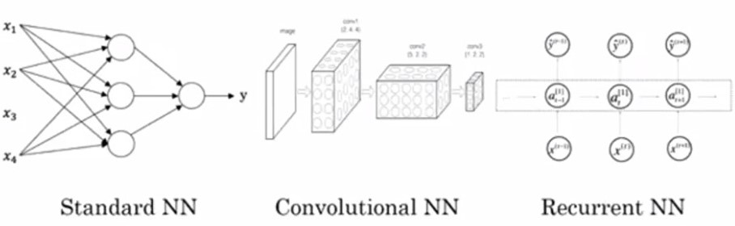

# 1. Introduction to Deep Learning

## 1.1 What is a Neural Network? 

**Simplest Neural Network (Linear Regression):**
- Neuron is the function to map the input data to the predicted variable
- E.g. housing price prediction: 
*Real Example*
*Simplified Network*

- Every input data is interconnected with the hidden layers.

## 1.2 Supervised Learning with Neural Network

**Applications:** 
- Real Estate Estimation (Standard NN) 
- Online Advertising (Standard NN)
- Photo Tagging (CNN)
- Speech recognition (RNN)
- Machine translation (RNN)
- autonomous driving (Complex/Hybrid NN)

**Data Types:**
- Structured Data
- Unstructured Data 

## 1.3 Why is Deep Learning Taking off?

**Scale-driven Learning:**

**Signal Functions:**
- Sigmoid:
    - Gradient is changing to 0, so the learning speed is slow.
- RELU: 
    - Gradient is constant, so as the leraning keeps going, the learning is run much **faster**.

----------

# Quiz

When an experienced deep learning engineer works on a new problem, they can usually use insight from previous problems to train a good model on the first try, without needing to iterate multiple times through different models. True/False?
- **False**. Finding the characteristics of a model is key to have good performance. Although experience can help, it requires multiple iterations to build a good model.

