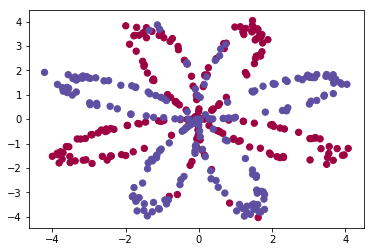
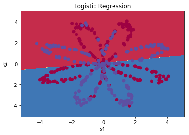
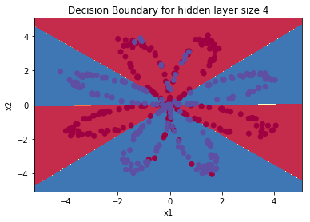
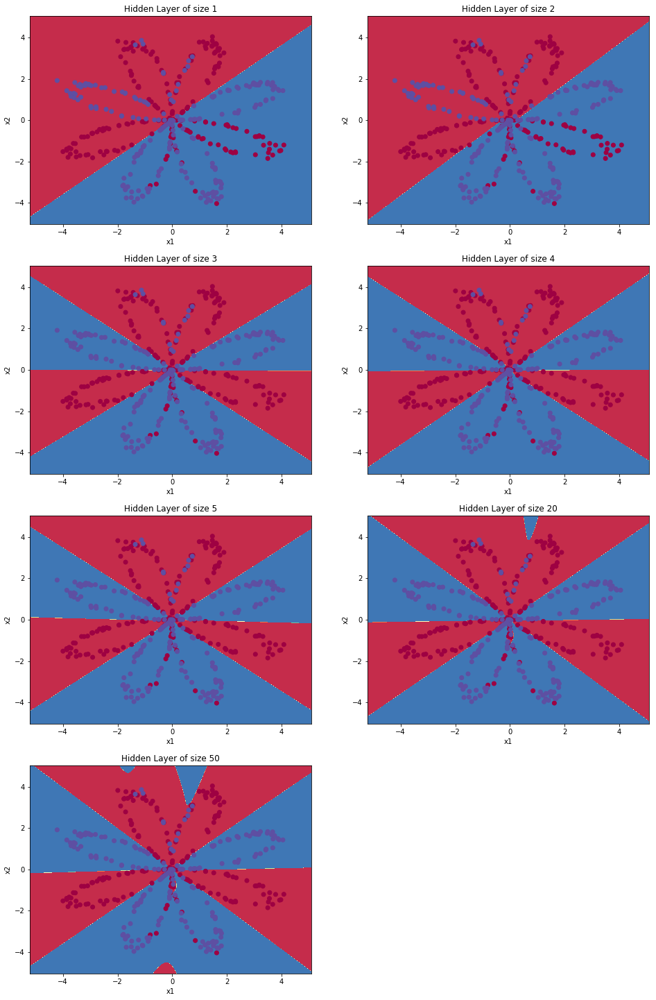
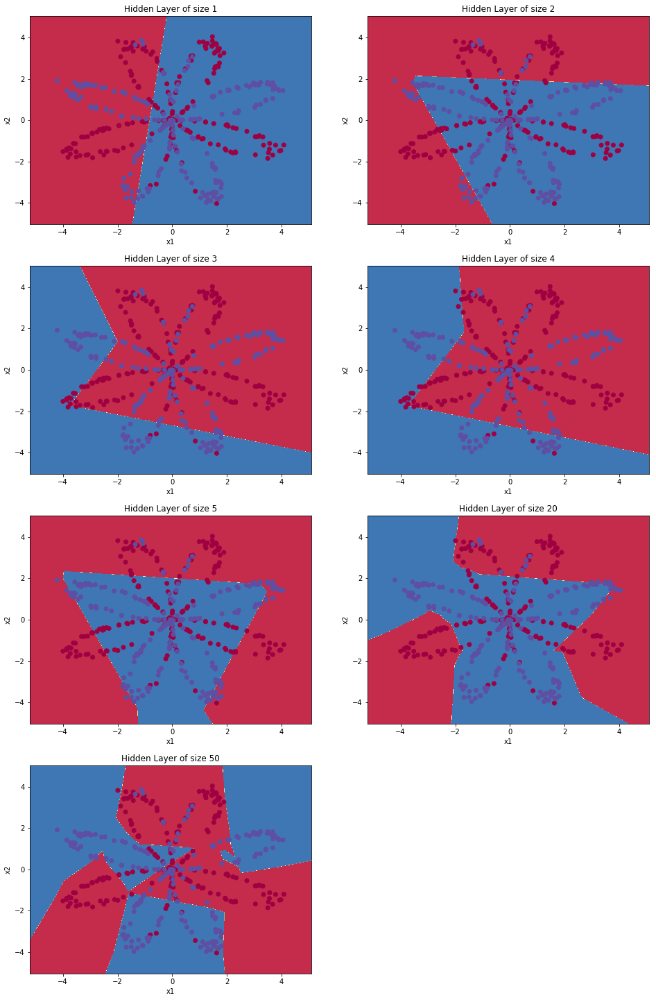

# 1. Shallow Neural Network

## 1.1 Neural Network Overview

**Notations:**
- Each training sample: $x^{(i)}$
- Each layer output: $z^{[i]}$
- Each hidden unit: $ a_{i} $

## 1.2 Neural Network Representation##


- $a^{[l]}_{i}$ represents the activations function at the node $i$ in the layer $l$.

## 1.3 Computing a Neural Network's Output

- Each node has two steps: one is weighted sum and another is the activation function. 

    

- Be aware that the $z^{[i]}$ or $a^{[i]}$ represents a stacked vector for one training sample. 

        

## 1.4 Vectorizing Across Multiple Examples

**Notations:**

- $a^{[2] \;(i)}$ represents the training sample $i$ in the $2$ layer. 

**How to Vectorize:** 

- The horizontal direction (column) represents the training samples, while the vertical direction (row) represent the hidden units.

    


## 1.5 Activation Functions

**Hyperbolic Tangent Function $g(z)$:**

- The function is defined as: 
$$ tanh(z) = \frac{e^{z} - e^{-z}}{e^{z} + e^{z}} $$

    
    
- Advantages: it has zero mean, so in most cases, after we normalize our data whose mean is zero as well, the overall learning performance is going to better than the sigmoid function.

- Rarely use the sigmoid function $ \sigma(z)$ except the output is binary classification $ y \in \{0, 1\} $.
    - Solution: we use the tanh function $g(z)$ in the middle layer, while the last layer we use the sigmoid function.  
    
- Downside: the gradient is very slow when $z$ is very large or small. It can slow down the gradient descent.

**Rectified Linear Unite $ReLU()$:**

- The function is defined as: 
$$ ReLU \; (z) = max(0, \; z) $$ 

     
    
- Advatange: the slop is either 1 or 0. The neural network can work much more faster.
    

**Leaking ReLU Function:**

- The function is defined as: 
$$ a \; (z) = max (0.01x, x) $$

     
    
- Same functions as $ ReLU() $ , while not widely used in practice.

**Rule of Thumb:**

- When doing the binary classification, the sigmoid function is the natural choice for the output layer.

- $ReLU()$ is the most common use. 

## 1.6 Why do you Need Non-linear Activation Functions?

- If we use a linear/identity activation function, i.e. $$ a (z) = z $$ the output of the neural networks is just **the linear combination of the input data**. Thus, no matter how many hidden layers are used, it is just computing the linear combination without any hidden layer.

- One place one may use the linear activation function is when the output is real numbers, i.e. $ y \in \mathbb{R} $ in the exmaple of housing price prediction. However, in this case, except the activation function in the output layer, all the other activation functions should use non-linear function.

## 1.7 Derivatives of Activation Functions

**Simgmoid Function:**

$$ g(z) = \frac{1}{1 + e^{-z}} $$


$$ g^{'(z)} = g(z)(1 - g(z)) $$

    More details are in Week2 Notes.

**Tanh Function:**

$$ g(z) = \frac{ e^{z} - e^{-z}}{e^{z} + e^{-z}} $$

$$ = \frac{e^{2z} -1}{e^{2z} + 1} $$ 

$$ = 1 - \frac{2}{e^{2z} + 1} $$ 


$$ g^{'(z)} = -2 \cdot -\frac{1}{(e^{2z} + 1)^2} \;\cdot e^{2z} \cdot 2 $$

$$ = 4 \frac{e^{2z}}{e^{4z} + 2e^{2z} + 1} $$

$$ = 1 - \frac{e^{2z} + e^{-2z} - 2}{e^{2z} + e^{-2z} + 2} $$ 

$$ = 1 - \frac{(e^{z} - e^{-z})^{2}}{(e^{z} + e^{-z})^2} $$

$$ = 1 - g(z)^2 $$

**$ReLU()$ Function:** 

$$ g(z) = max (0, z) $$


\begin{equation}
  g^{'(z)}=\begin{cases}
    0, & \text{if $z<0$}.\\
    1, & \text{if $z \geq 0$}.
  \end{cases}
\end{equation}

**Leaky $ReLU()$ Function:** 

$$ g(z) = max (0.01z, z) $$


\begin{equation}
  g^{'(z)}=\begin{cases}
    0.01, & \text{if $z<0$}.\\
    1, & \text{if $z \geq 0$}.
  \end{cases}
\end{equation}

## 1.8 Gradient Descent for Neural Networks

- Gradient Descent Algorithm:
    - Randomly initialize parameters:
    
    $$ W^{[1]}_{(n^{[1]}, \; n^{[0]})}, \; b^{[1]}_{(n^{[1]}, \; 1)}, \; W^{[2]}_{(n^{[2]}, \; n^{[1]})}, \; b^{[2]}_{(n^{[2]}, \; 1)}, \text{where $ n^{[0]} = m, n^{[2]} = 1 $ (two layers) } $$
    
    - Goal: minimize the cost function 
    
    $$ J(W^{[1]}, \; b^{[1]}, \; W^{[2]}, \; b^{[2]}) = \frac{1}{m} \; \sum_{i = 1}^{m} \; \mathcal{L}(\hat{y}, y) $$
    
    - Repeat: {
        
    compute prediction: 
$$(\hat{y}^{(i)}, \; i=1,...,m)$$ 
        
    compute derivatives: 
$$ dW^{[i]} = \frac{\partial J}{\partial W^{[i]}} $$
$$ db^{[i]} = \frac{\partial J}{\partial b^{[i]}} $$
    
    update parameters: 
$$ W^{[i]} := W^{[i]} - \alpha \; dW^{[i]} $$
$$ b^{[i]} := b^{[i]} - \alpha \; db^{[i]} $$


- Formulas for forward propogation: 

$$ Z^{[1]} = W^{[1]} \; A^{[0]}+ b^{[1]} $$ 

$$ A^{[1]} = g^{[1]} \; (Z^{[1]}) $$

$$ Z^{[2]} = W^{[2]} \; A^{[1]} + b^{[2]} $$ 

$$ A^{[2]} = g^{[2]} \; (Z^{[2]}) = \sigma \; (Z^{[2]}) $$


- Formulas for backward propogation:

$$ dA^{[2]} = \frac{\partial \mathcal{L}(A^{[2]}, Y)}{\partial a} = -\frac{Y}{A^{[2]}} + \frac{1-Y}{1-A^{[2]}} $$ 

$$ dZ^{[2]} = dA^{[2]} \; A^{[2]}(1-A^{[2]}) = A^{[2]} - Y $$

$$ dW^{[2]} = \frac{1}{m} \; dZ^{[2]} A^{[1]T} $$ 

$$ db^{[2]} = \frac{1}{m} \; \text{np.sum($dZ^{[2]}$, axis = 1, keepdims = True)} $$ 

$$ dZ^{[1]} = W^{[2]\;T} dZ^{[2]} \ast g^{[z]'}(Z^{[1]}) \text{, where $\ast$ is the element-wise product} $$

$$ dW^{[1]} = \frac{1}{m} \; dZ^{[1]}X^{T} $$

$$ db^{[1]} = \frac{1}{m} \; \text{np.sum($dZ^{[1]}$, axis = 1, keepdims = True)} $$


The reason why $\frac{1}{m}$ appears is that the cost function $J = \sum_{i=1}^{m} $.  


## 1.9 Random Initialization

- Why Should not Initialize all Weights as 0  
    - If we initialize our weights as 0, it turns out that in each iteratin, every hidden node in each layer is computing the same function. It means every hidden node has the same contributions to the next hidden layer. 

    - Meanwhile, the updates in the backward propotation are same as well. 

- Solutions:
    
    - Initialize weights as small random variables 
    
$$ W^{[i]} = \text{np.random.rand(2,2)} \ast 0.01 $$

$$ b^{[i]} = \text{np.zeros(2,1)}$$


Why is there a constant scaler 0.01? Why not 100?
    
- The reason is that we want our values are smaller before entering the activation function. In some cases, let's say the tanh() or simgoid() function, when the weights are too large, the outputs of the activation function are also very large. It turns out that the slopes are very small, which means the learning rates are very small.

- In the shallow neural network, the scaler can be constant; but in the deep neural network, the best choice is to select different small scalers for each layer. 

-----------

# Quiz

Logistic regression’s weights w should be initialized randomly rather than to all zeros, because if you initialize to all zeros, then logistic regression will fail to learn a useful decision boundary because it will fail to “break symmetry”, True/False?

- False. **Logistic Regression doesn't have a hidden layer**. If you initialize the weights to zeros, the first example x fed in the logistic regression will output zero but the derivatives of the Logistic Regression depend on the input x (because there's no hidden layer) which is not zero. So at the second iteration, the weights values follow x's distribution and are different from each other if x is not a constant vector. 

---------------

# Assignments

## Planar Data Classification with One Hidden Layer

**Problems:**
- Classify the following data with one hidden layer. 
    


**Our Model:**


**Mathematics:**

For one example $x^{(i)}$:

$$z^{[1] (i)} =  W^{[1]} x^{(i)} + b^{[1]}\tag{1}$$ 

$$a^{[1] (i)} = \tanh(z^{[1] (i)})\tag{2}$$

$$z^{[2] (i)} = W^{[2]} a^{[1] (i)} + b^{[2]}\tag{3}$$

$$\hat{y}^{(i)} = a^{[2] (i)} = \sigma(z^{ [2] (i)})\tag{4}$$

$$y^{(i)}_{prediction} = \begin{cases} 1 & \mbox{if } a^{[2](i)} > 0.5 \\ 0 & \mbox{otherwise } \end{cases}\tag{5}$$


**Notations:**

- The size of the input layer n_x: the number of features of each input sample 

- The size of the hidden layer n_h: the number of hidden units in this layer 

- The size of the output layer n_y: the number of features of the output variable 


Thus, 

$$ W^{[1]} : [n_h, n_x], \; b^{[1]} : [n_h, 1] $$

$$ W^{[2]} : [n_y, n_h], \; b^{[2]} : [n_y, 1] $$


**Results:**

- Simple Logistic Regression: 
    
    only 47% accuracy 

    

- One Hidden Layer: 

    90% accuracy
    
    

**Reflections:**

- **Learning rate** should be chosen carefully: 

    
    


- Tuning **Hidder Layer Size**:

```Python
Accuracy for 1 hidden units: 67.5 %
Accuracy for 2 hidden units: 67.25 %
Accuracy for 3 hidden units: 90.75 %
Accuracy for 4 hidden units: 90.5 %
Accuracy for 5 hidden units: 91.25 %
Accuracy for 20 hidden units: 90.5 %
Accuracy for 50 hidden units: 90.75 %
```

- 

    - Interpretation:
        - The larger models (with more hidden units) are able to fit the training set better, until eventually the largest models **overfit the data**. 
        - The best hidden layer size seems to be around n_h = 5. Indeed, a value around here seems to  fits the data well without also incurring noticeable overfitting.
        - You will also learn later about **regularization**, which lets you use very large models (such as n_h = 50) without much overfitting. 
        

- $tanh()$ is better than $ReLU()$ in this dataset: 
```Python
Accuracy for 1 hidden units: 51.0 %
Accuracy for 2 hidden units: 61.75000000000001 %
Accuracy for 3 hidden units: 62.5 %
Accuracy for 4 hidden units: 61.75000000000001 %
Accuracy for 5 hidden units: 61.75000000000001 %
Accuracy for 20 hidden units: 72.25 %
Accuracy for 50 hidden units: 77.75 %
``` 
- 

# Resources

- A better Way to Visualize Back Propogation: 

    - https://google-developers.appspot.com/machine-learning/crash-course/backprop-scroll/
    - http://colah.github.io/posts/2015-08-Backprop/
    
    
