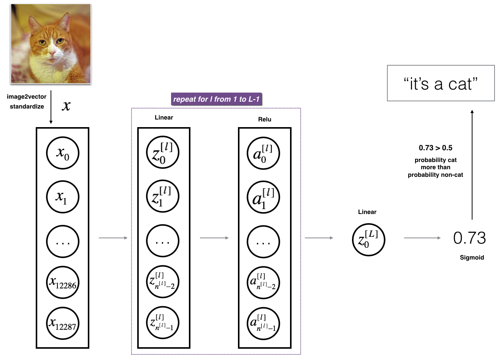

# 1. Deep Neural Network

## 1.1 Notations in Deep L-layer Neural Network

**Notations:**


- Number of layers: $L$

- Number of units in layer $l$ : $n^{[l]} $ 

$$ n^{[0]} = n_{x} = 3, \; n^{[1]} = n^{[2]} = 5, \; n^{[3]} = 3, \; n^{[4]} = n^{[L]} = 1 $$

- Outputs of activation functions in layer $l$ : $ a^{[l]} $

$$ a^{[l]} = g^{[l]} \; (Z^{[l]}) $$ 

$$ \text{where} \; a^{[0]} = x, \; \hat{y} = a^{[L]} $$

- Parametres and outputs in layer $l$ :

$$ W^{[l]}, \; b^{[l]} \; for Z^{[l]} $$

## 1.2 Vectorized Forward Propogation

**Vectorization:**

- for $i = 1, ..., L:$ 

$$ Z^{[i]} = W^{[i]} A^{[i-1]} + b^{[i]} $$

$$ A^{[i]} = g^{[i]} \; (Z^{[i]}) $$

- The for-loop for each layer is unavoidable in the vectorization.

**Debugging Using the Matrix Dimensions:**

- Parameters $ W^{[l]}$ and $b^{[l]}$: 

$$ Z^{[l]} : (n^{[l]}, \;m) $$

$$ W^{[l]} : (n^{[l]}, \; n^{[l-1]}) $$ 

$$ b^{[l]} : (n^{[l]}, \; 1) \text{, but will be broadcasted to } \; (n^{[l]}, m)$$
$$ \text{it means each node/row only needs one bias} $$

- The output in each layer is kind equal to the number of nodes in that layer. It means each node is going to output one row of results.

## 1.3 Why Deep Network Works Well?

**Face Recognization:**


- The First layer may produce low-level features, such as edges. Then, the following layers are going to group these low-level features together, i.e. generating some parts of face such as eyes, nose, etc. Finally, a face can be built up using different parts of face for detecting faces.


**Circuit Theory:**


- There are functions you can compute with a "small" L-layer deep neural network $O(\log n)$ that shallower networks $O(2^{n})$ require exponentially more hidden units to compute. 

## 1.4 Blocks of DNNs

In layer $l$ : 

- Initialize $W^{[l]}$, \; $b^{[l]}$

- Forward: input $a^{[l-1]}$, output $a^{[l]}$, cache $Z^{[l]}, \; W^{[l]}, \;  b^{[l]} $ 
    
    where  $Z^{[l]}%$, $W^{[l]}$ and $b^{[l]}$ are cached during forward propagation to the corresponding backward propagation step, which contain useful values for backward propagation to compute derivatives. 

- Backward: input $ da^{[l]}$ and the cached data, output $ da^{[l-1]}, \; dW^{[l]},  \; db^{[l]} $ 

- Update: $ W^{[l]} = W^{[l]} - \alpha \; dW^{[l]} $ and $ b^{[l]} = b^{[l]} - \alpha \; db^{[l]} $ 


## 1.5 Forward and Backward Propogation

- Forward propogation for layer $l$ :

$$ Z^{[l]} = W^{[l]} A^{[l-1]} + b^{[l]} $$

$$ A^{[l]} = g^{[l]} \; (Z^{[l]}) $$

- Backward propogation for layer $l$ :

$$ dZ^{[l]} = dA^{[l]} \ast g^{[l]\;'}\;(Z^{[l]}) $$

$$ dW^{[l]} = \frac{1}{m} \; dZ^{[l]} A^{[l-1]\;T} $$

$$ db^{[l]} = \frac{1}{m} \; \text{np.sum( $dZ^{[l]}$, axis=1, keepdim=True)} $$

$$ dA^{[l-1]} = W^{[l]\;T} dZ^{[l]} $$ 

    where (if we use the sigmoid function in the output layer) 
$$dA^{[L]} = \frac{1}{m} \; \sum_{i=1}^{m}(-\frac{y^{(i)}}{a^{(i)}} + \frac{1-y^{(i)}}{1-a^{(i)}}) $$


## 1.6 Parameters vs Hyperparameters

**Parameters:**

- $W^{[l]}$ and $b^{[l]}$

**Hyperparameters:**

- Learning rate: $\alpha$

- Number of iterations of Gradient Descent

- Number of layers: $L$

- Number of hidden unites: $n^{[l]}$

- Choice of activation function

- Momentum

- Minibatch

- Size

- regularization parameters

Selecting the **optimal** hyperparameters is a very **empirical process**. One has to try out a range of settings for differernt datasets.


--------

# Quiz

Actication function is one of the hyperparameters but the activation values are not. 

---------

# Assignments

## 1. Building your Deep Neural Network

**Model:**


**Model Design:**

- Initialize: 

    - Use a varaible *layer_dims* to record the size of each layer. Specifically, *layer_dims[0]* stores the size of each input feature, also known as $n^{[0]}$. 
    
    - Then, use a helper functions to store all initial parameters in to a varibale. Using a dictionary is better for retrieve and store, i.e. 
    
    ``` Python
        parameters['W' + str(l)] = ...
        parameters['b' + str(l)] = ... # column is always one because of python broadcasting 
    ```    

- Forward: 

    - First do linear combination in a helper function. Note that the output $Z$ and parameters $W,b$ should be cached in a variable *linear_cache*.
    
    $$Z^{[l]} = W^{[l]}A^{[l-1]} +b^{[l]}\tag{4}$$
    
    - Then, use another helper function to compute the activation value, the output $A$ and input $Z$ should also be cached in a variable *activation_cache*.  
    
    - Finally, use a for loop to go over each hidden layer, ended up with the last output layer.

    


- Backward: 
    
    - create a helper function to compute the gradients in each layer, including $dW^{[l]}, db^{[l]}, \text{and} \; dA^{[l-1]}$. The input parameters only require $dZ \; \text{and} \; linear_cache$
    
    - use the same programming idea to compute $dZ$ for each layer: 
        - first compute the $dZ$ from the output layer
        - then loop all the other hidder layers 
        - store the gradients into a vairable *grads*

    - finally, update all the parameters in another loop
    
    

## 2. Deep Neural Network - Application

**Problem:**

- Cat Classification 

    

**Model:**

- 2 layer neural network 

- L-layer deep neural network

    

**Results:** 

- 2 layer NN: 

    ```python
    Cost after iteration 0: 0.6930497356599888
    Cost after iteration 100: 0.6464320953428849
    Cost after iteration 200: 0.6325140647912677
    Cost after iteration 300: 0.6015024920354665
    Cost after iteration 400: 0.5601966311605747
    Cost after iteration 500: 0.515830477276473
    Cost after iteration 600: 0.4754901313943325
    Cost after iteration 700: 0.4339163151225749
    Cost after iteration 800: 0.4007977536203887
    Cost after iteration 900: 0.3580705011323798
    Cost after iteration 1000: 0.3394281538366412
    Cost after iteration 1100: 0.3052753636196264
    Cost after iteration 1200: 0.27491377282130164
    Cost after iteration 1300: 0.24681768210614846
    Cost after iteration 1400: 0.19850735037466116
    Cost after iteration 1500: 0.1744831811255664
    Cost after iteration 1600: 0.17080762978096148
    Cost after iteration 1700: 0.11306524562164734
    Cost after iteration 1800: 0.09629426845937152
    Cost after iteration 1900: 0.08342617959726863
    Cost after iteration 2000: 0.07439078704319081
    Cost after iteration 2100: 0.0663074813226793
    Cost after iteration 2200: 0.0591932950103817
    Cost after iteration 2300: 0.053361403485605585
    Cost after iteration 2400: 0.04855478562877016
        
    Training Accuracy: 1.0
    Testing Accuracy: 0.72
    ```
    
    
    
    
- L-layer dnn: 
    
    ```python 
    Cost after iteration 0: 0.695046
    Cost after iteration 100: 0.589260
    Cost after iteration 200: 0.523261
    Cost after iteration 300: 0.449769
    Cost after iteration 400: 0.420900
    Cost after iteration 500: 0.372464
    Cost after iteration 600: 0.347421
    Cost after iteration 700: 0.317192
    Cost after iteration 800: 0.266438
    Cost after iteration 900: 0.219914
    Cost after iteration 1000: 0.143579
    Cost after iteration 1100: 0.453092
    Cost after iteration 1200: 0.094994
    Cost after iteration 1300: 0.080141
    Cost after iteration 1400: 0.069402
    Cost after iteration 1500: 0.060217
    Cost after iteration 1600: 0.053274
    Cost after iteration 1700: 0.047629
    Cost after iteration 1800: 0.042976
    Cost after iteration 1900: 0.039036
    Cost after iteration 2000: 0.035683
    Cost after iteration 2100: 0.032915
    Cost after iteration 2200: 0.030472
    Cost after iteration 2300: 0.028388
    Cost after iteration 2400: 0.026615
    
    Training Accuracy: 1.0
    Testing Accuracy: 0.8
    ```
    
    


**Results Analysis:**

**A few types of images the model tends to do poorly on include** 
- Cat body in an unusual position

- Cat appears against a background of a similar color

- Unusual cat color and species

- Camera Angle

- Brightness of the picture

- Scale variation (cat is very large or small in image) 


